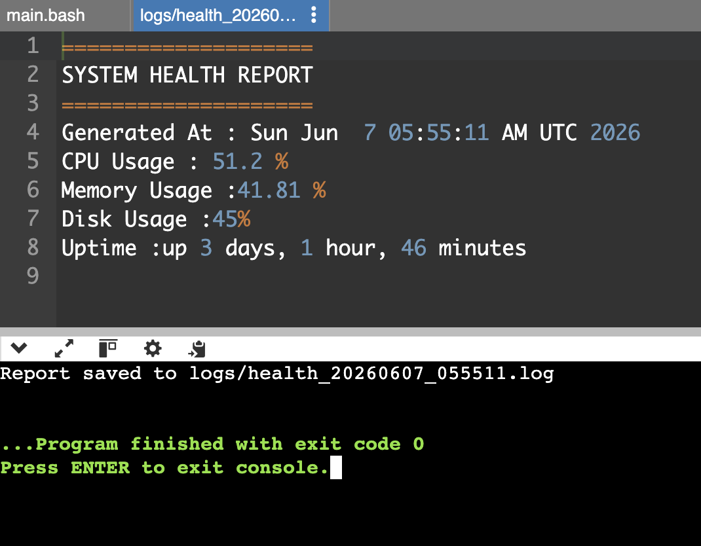

# Linux System Health Monitor

A lightweight Bash script designed to monitor system health metrics, output a formatted report, save it to a log file, and warn you if resource thresholds are exceeded.

## Features

- **CPU Usage Monitoring**: Calculates the current CPU usage percentage.
- **Memory Usage Monitoring**: Checks the memory usage percentage and warns if it exceeds 75%.
- **Disk Usage Monitoring**: Tracks the root disk partition (`/`) usage and warns if it exceeds 80%.
- **Uptime Tracking**: Reports the current system uptime.
- **Automated Logging**: Saves each report to a unique timestamped file under the `logs/` directory.

## Sample Report Output

Here is an example of what the generated report looks like:



## Installation & Setup

1. **Clone or copy the script**:
   Save `health_monitor.sh` to your system.

2. **Make the script executable**:
   ```bash
   chmod +x health_monitor.sh
   ```

3. **Run the script**:
   ```bash
   ./health_monitor.sh
   ```

## Logs Directory

The script automatically creates a `logs/` directory and saves the report as:
`logs/health_YYYYMMDD_HHMMSS.log`
